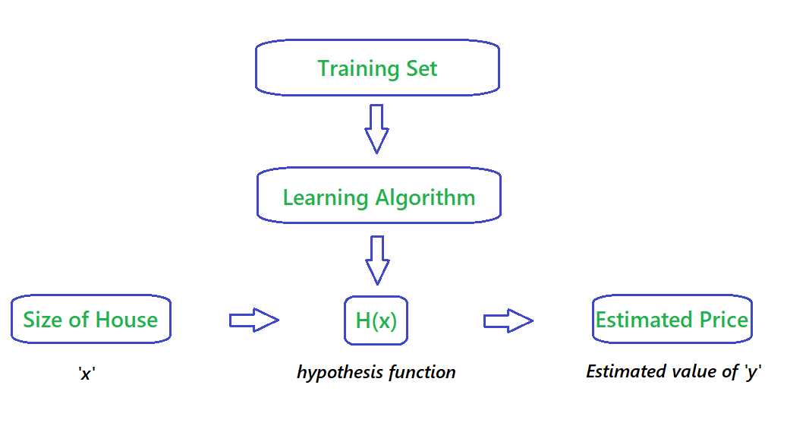
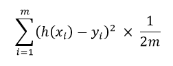
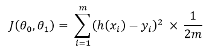
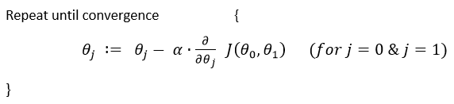
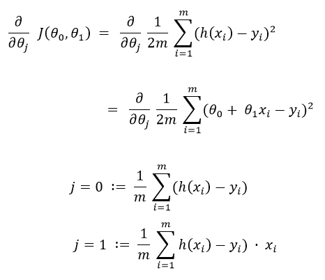
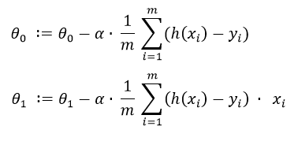
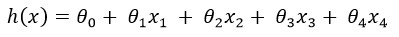
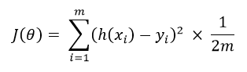

# Machine Learning Algorithms

## Table of Contents

- [Description](#description)
- [Notations](#notations)
- [Linear Regression](#linear-regression)
    - [Univariate Linear Regression](#univariate-linear-regression)
    - [Multivariate Linear Regression](#multivariate-linear-regression) 

## Description
A quick guide and understanding of how famous Machine Learning Algorithms work. Also given links to other study materials in order to understand the concepts more concretly.

## Notations
- `m` 👉 Number of Training Examples.
- `x` 👉 "input" variable / features.
- `y` 👉 "ouput" variable / "target" variable.
- `n` 👉 Number of feature variable `(x)`
- `(x, y)` 👉 One training example.
- `x`i , `y`i  👉 ith training example.
- `x`ij 👉 ith training example of the jth column / feature.

-----

## Linear Regression
### Definition
A linear equation that models a function such that if we give any `x` to it, it will predict a value `y` , where both `x and y` are input and output varaibles respectively. These are numerical and continous values.

It is the most simple and well known algorithm used in machine learning.

### Flowchart 

 

The above Flowchart represents that we choose our training set, feed it to an algorithm, it will learn the patterns and will output a function called `Hypothesis function 'H(x)'`. We then give any `x` value to that function and it will output an estimated `y` value for it.

For historical reasons, this function `H(x)` is called `hypothesis function.`

### Univariate Linear Regression
#### Definition
When you have one feature / variable `x` as an input to the function to predict `y`, we call this `Univariate Linear Regression` problem.

#### Formula

H(x) = θ0 + θ1x

Other way of representing this formula as what we are familiar with:

H(x) = b + mx

> Where :
>- b = θ0 👉 y intercept
>- m = θ1 👉 slope
>- x = x 👉 feature / input variable

<a href = 'https://archive.cnx.org/contents/20986bfa-2c2a-47f1-a48a-786122b0c606@3/graphical-analysis-of-one-dimensional-motion'>Source</a>

 

> **Help** ✍🏼 
> - <a href = 'https://www.khanacademy.org/math/algebra/two-var-linear-equations/slope-intercept-form/v/slope-intercept-form'>Intuition behind linear equation.</a>
> - <a href = 'https://www.khanacademy.org/math/algebra/two-var-linear-equations/slope-intercept-form/e/slope-from-an-equation-in-slope-intercept-form'>Need to Practice?</a>

-----

#### Cost Function
All that said, how do we figure out the best possible straight line to the data that we feed?

**This is where `Cost Function` will help us:**

The best fit line to our data will be where we have least distance between the `predicted 'y' value` and `trained 'y' value`.

##### Formula :

> Where :
>- h(xi) 👉 hypothesis function
>- yi 👉 actual values of `y`
>- 1/m 👉 gives Mean of Squared Errors
>- 1/2 👉 Mean is halved as a convenience for the computation of the `Gradient Descent`.

The above formula takes the sum of the distances between <i>`predicted values` and `actual values` of training set, sqaure it, take the average and multiply it by `1/2`.</i>
 
 
This cost function is also called as `Squared Error Function` or `Mean Squared Error`.
 
 
🙋‍ Why do we take squares of the error's? 
The `MSE` function is commonly used and is a reasonable choice and works well for most Regression problems.
 
 
Let's subsititute `MSE` function to function `J` :

 
 

> **Help** ✍🏼 
> - <a href='https://youtu.be/0kns1gXLYg4'>Intuition behind Cost Function.</a>

-----

#### Gradient Descent
So now we have our hypothesis function and we have a way of measuring how well it fits into the data. Now we need to estimate the parameters in the hypothesis function. That's where `Gradient Descent` comes in. 
`Gradient Descent` is used to minimize the cost function `J`, minimizing `J` is same as minimizing `MSE` to get best possible fit line to our data.

##### Formula :

> Where :
>- `:=` 👉 Is the Assignment Operator
>- `α` 👉 is `Alpha`, it's the number which is called learning rate. If its too high it may fail to converge and if too low then descending will be slow.
>- 'θj' 👉 Taking Gradient Descent of a feature or a column of a dataset.
> - ∂/(∂θj) J(θ0,θ1) 👉 Taking partial derivative of `MSE` cost function.

 
 

> **Additional Resources** ✍🏼 
> - <a href='https://youtu.be/YovTqTY-PYY'>Intuition behind Gradient Descent.</a>
> - <a href='https://www.khanacademy.org/math/multivariable-calculus/multivariable-derivatives/partial-derivatives/v/partial-derivatives-introduction'>Partial Derivative.</a>

 
 

**Now Let's apply Gradient Descend to minmize our `MSE` function.**
 
In order to apply `Gradient Descent`, we need to figure out the partial derivative term. 
So let's solve partial derivative of cost function `J`.

 

 

Now let's plug these 2 values to our `Gradient Descent`:

 

 

> **Note :** 🚩 
> - Cost Function for Linear Regression is always going to be Convex or Bowl Shaped Function, so this function doesn't have any local minimum but one global minimum, thus always converging to global minimum.
> - The above hypothesis function has 2 parameters, θ0 & θ1, so Gradient Descent will run on each feature, hence here two times, one for feature and one for base `(y-intercept)`, to get minimum value of `j`. So if we have `n` features, Gradient Descent will run on all `n+1` features.

-----

### Multivariate Linear Regression

> **Linear Algebra** ✍🏼 
> - <a href='https://www.khanacademy.org/math/precalculus/vectors-precalc/modal/v/introduction-to-vectors-and-scalars'>Intro to Vectors & Scalars.</a>
> - <a href=  'https://www.khanacademy.org/math/precalculus/vectors-precalc/modal/a/vector-operations-review'>Combined Vector Operations.</a>
> - <a href=  'https://www.khanacademy.org/math/precalculus/precalc-matrices/modal/v/introduction-to-the-matrix'>Intro to Matrices.</a>
> - <a href=  'https://www.khanacademy.org/math/precalculus/precalc-matrices/modal/a/representing-systems-with-matrices'>Representing linear systems with matrices.</a>
> - <a href=  'https://www.khanacademy.org/math/precalculus/precalc-matrices/modal/v/matrix-addition-and-subtraction-1'>Add & subtract matrices.</a>
> - <a href=  'https://www.khanacademy.org/math/precalculus/precalc-matrices/modal/v/matrix-multiplication-intro'>Multipling matrices.</a>
> - <a href=  'https://www.khanacademy.org/math/precalculus/precalc-matrices/modal/v/identity-matrix'>Identity Matrix.</a>
> - <a href=  'https://www.khanacademy.org/math/precalculus/precalc-matrices/modal/a/properties-of-matrix-multiplication'>Properties of Matrix Multiplication.</a>
> - <a href=  'https://www.khanacademy.org/math/precalculus/precalc-matrices/modal/v/inverse-matrix-part-1'>Matrix Inverses.</a>
> - <a href=  'https://www.khanacademy.org/math/linear-algebra/matrix-transformations/matrix-transpose/v/linear-algebra-transpose-of-a-matrix'>Matrix Transpose.</a>

#### Definition
Its same as `Univariate Linear Regression`, except it has more than one feature variable `(x)` to predict target variable `(y)`.

#### Formula:
Our hypothesis function for `n` = 4 :

 

> Where :
>- θ0 👉 y intercept
> - And rest are features `x` to help predict `y` value.
>> **Intuition:** 
>>In order to develop an intuition about this function, let's imagine that this function represents price of a house `(y)` based on the features given `(x)`, then we can think of this function as:
>> - θ0 as the basic price of a house.
>> - θ1 as price/m2.
>> - x1 as area of a house (m2).
>> - θ2 as price/floor.
>> - x2 as number of floors.
>> - etc _(You get the idea)_

 
 

Let's set all the parameters:

<b> θ0, θ1, θ2, θ3.......θn = θ </b>

 
And Let's set all the features:

<b> x0, x1, x2, x3.......xn = x </b>

 

> Where :
>- θ 👉 will be `n+1` dimensional vector because we have θ0 which is not a feature.
> - x0 👉 is added just for convenience so that we can take matrix multiplication of `θ` as θT and `x` and we will set its value to 1, so this doesn't change the values.
> - x 👉 will also be `n+1` dimensional vector.

 
 

#### Cost Function :

So, 

J(θ0, θ1, θ2, θ3.......θn) = J(θ)

 
Where,

