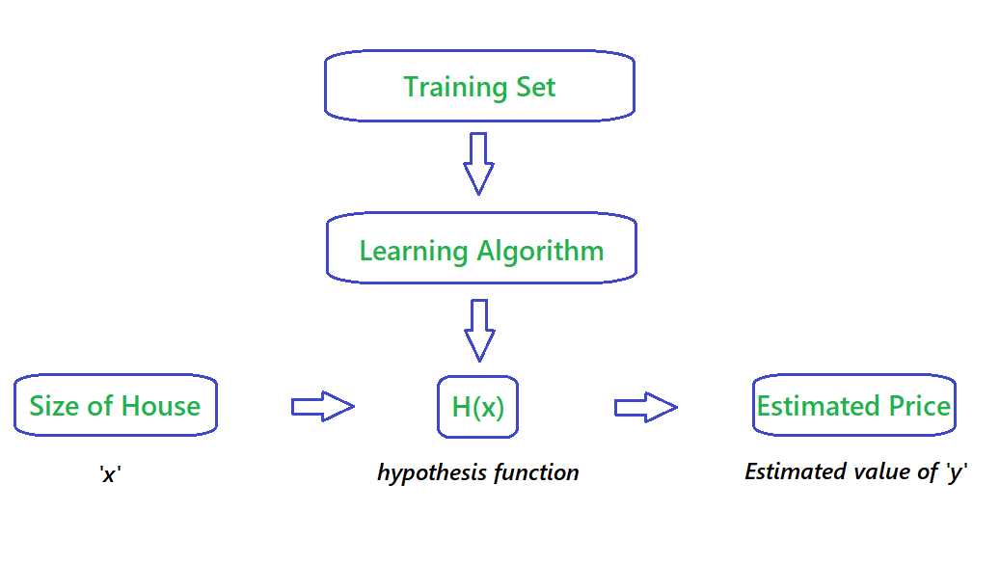

# Machine Learning Algorithms

## Table of Contents

- [Description](#description)
- [Notations](#notations)
- [Linear Regression](#linear_regression)

## Description
A quick guide and understanding of how famous Machine Learning Algorithms work. Also given links to other study materials in order to understand the concepts more concretly.

## Notations
- `m` 👉 Number of Training Examples.
- `x` 👉 "input" variable / features.
- `y` 👉 "ouput" variable / "target" variable.
- `(x, y)` 👉 One training example.
- `x`i , `y`i  👉 ith training example.
- `x`ij 👉 ith training example of the jth column / feature.

-----

## Linear Regression
### Definition
A linear equation that models a function such that if we give any `x` to it, it will predict a value `y` , where both `x and y` are input and output varaibles respectively. These are numerical and continous values.

It is the most simple and well known algorithm used in machine learning.

### Flowchart 

 

The above Flowchart represents that we choose our training set, feed it to an algorithm, it will learn the patterns and will output a function called `Hypothesis function 'H(x)'`. We then give any `x` value to that function and it will output an estimated `y` value for it.

For historical reasons, this function `H(x)` is called `hypothesis function.`

### Univariate Linear Regression
#### Definition
When you have one feature / variable `x` as an input to the function to predict `y`, we call this `Univariate Linear Regression` problem.

#### Formula

H(x) = θ0 + θ1x

Other way of representing this formula as what we are familiar with:

H(x) = b + mx

> Where :
>- b = θ0 👉 y intercept
>- m = θ1 👉 slope
>- x = x 👉 feature / input variable

<a href = 'https://archive.cnx.org/contents/20986bfa-2c2a-47f1-a48a-786122b0c606@3/graphical-analysis-of-one-dimensional-motion'>Source</a>

 

> **Need Help?**
>> - <a href = 'https://www.khanacademy.org/math/algebra/two-var-linear-equations/slope-intercept-form/v/slope-intercept-form'>Intuition behind linear equation.</a>
>> - <a href = 'https://www.khanacademy.org/math/algebra/two-var-linear-equations/slope-intercept-form/e/slope-from-an-equation-in-slope-intercept-form'>Need to Practice?</a>